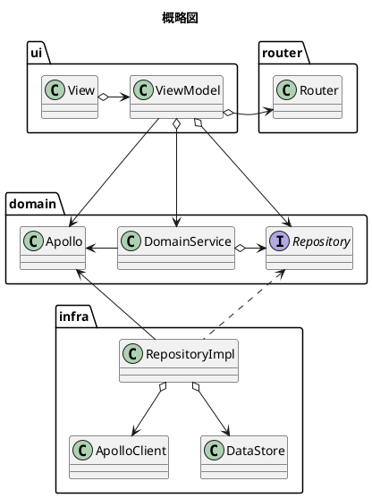

# アーキテクチャ概要

```plantuml
@startuml

title 概略図

package ui {
    class View
    class ViewModel
}

package router {
    class Router
}

package domain {
    class Apollo
    class DomainService
    interface Repository
}

package infra {
    class RepositoryImpl
    class ApolloClient
    class DataStore
}

View o-> ViewModel
ViewModel o-> Router
ViewModel o---> DomainService
ViewModel o--> Repository
ViewModel -> Apollo
DomainService -> Apollo
DomainService o-> Repository
RepositoryImpl -up-> Apollo
RepositoryImpl .up.> Repository
RepositoryImpl o--> ApolloClient
RepositoryImpl o--> DataStore

@enduml
```
